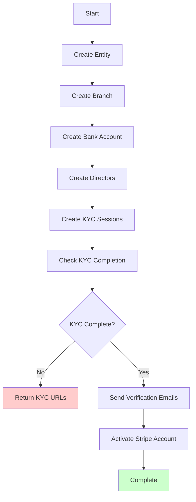

# Partner API Documentation

## Overview

The Partner API provides programmatic access to Pebl's franchise setup process. This API allows partners to create and manage franchise entities, handle KYC verification, activate payment processing accounts, and create orders for their entities.

## Base URL

- **Staging**: `https://stage-pebl.web.app`
- **Production**: `https://prod-pebl.web.app`

## Authentication

All API requests require authentication using an API key. Contact your Pebl representative for API credentials.

### Authentication Headers

Include your API key in the `x-api-key` header:

```bash
x-api-key: your-api-key-here
```

Alternatively, you can use the `Authorization` header with Bearer format:

```bash
Authorization: Bearer your-api-key-here
```

## Sample Request

Here's an example of how to make a request with authentication:

```bash
curl -X POST "https://stage-pebl.web.app/api/partner/entity" \
  -H "x-api-key: your-api-key-here" \
  -H "Content-Type: application/json" \
  -d '{
    "business": {
      "abn": "12345678901",
      "entityType": "company",
      "entityStructure": "proprietary_limited",
      "mcc": "1520",
      "website": "https://example.com",
      "logoUrl": "https://example.com/logo.png"
    },
    "address": {
      "line1": "123 Business St",
      "line2": "",
      "city": "Sydney",
      "state": "NSW",
      "postcode": "2000",
      "country": "Australia",
      "countryCode": "AU"
    },
    "branch": {
      "name": "Sydney Branch",
      "contact": {
        "email": "jane@business.com",
        "phone": "+61412345678"
      }
    },
    "bankAccount": {
      "accountName": "Business Name",
      "accountNumber": "123456789",
      "bsb": "012-345"
    },
    "directors": [
      {
        "firstName": "John",
        "lastName": "Smith",
        "email": "john@business.com",
        "phone": "+61412345679",
        "percentOwnership": 50,
        "dateOfBirth": {
          "day": 1,
          "month": 1,
          "year": 1980
        },
        "address": {
          "line1": "789 Director St",
          "line2": "",
          "city": "Sydney",
          "state": "NSW",
          "postcode": "2000",
          "country": "Australia",
          "countryCode": "AU"
        },
        "relationship": "director"
      }
    ]
  }'
```

## Endpoints

### 1. Get Entity Status

**GET** `/api/partner/entity/{entityId}`

Retrieves the current status of a specific entity.

#### Parameters

| Parameter | Type | Description |
|-----------|------|-------------|
| `entityId` | string | Unique identifier for the entity |

#### Response

```json
{
  "success": true,
  "id": "entity-123",
  "partnerId": "partner-456",
  "name": "Business Name",
  "abn": "12345678901",
  "status": "active",
  "address": {
    "line1": "123 Business St",
    "line2": "",
    "city": "Sydney",
    "state": "NSW",
    "postcode": "2000",
    "country": "Australia",
    "countryCode": "AU"
  },
  "accessedAt": "2024-01-15T10:30:00.000Z"
}
```

### 2. Create Entity

**POST** `/api/partner/entity`

Creates a new franchise entity with all associated resources. This is a multi-step operation that handles entity creation, branch setup, bank account configuration, director management, KYC verification, and account activation.

#### Request Body

```json
{
  "idempotencyKey": "your-unique-key",
  "business": {
    "abn": "12345678901",
    "entityType": "company",
    "entityStructure": "proprietary_limited",
    "mcc": "1520",
    "website": "https://example.com",
    "logoUrl": "https://example.com/logo.png"
  },
  "address": {
    "line1": "123 Business St",
    "line2": "",
    "city": "Sydney",
    "state": "NSW",
    "postcode": "2000",
    "country": "Australia",
    "countryCode": "AU"
  },
  "branch": {
    "name": "Sydney Branch",
    "contact": {
      "email": "jane@business.com",
      "phone": "+61412345678"
    }
  },
  "bankAccount": {
    "accountName": "Business Name",
    "accountNumber": "123456789",
    "bsb": "012-345"
  },
  "directors": [
    {
      "firstName": "John",
      "lastName": "Smith",
      "email": "john@business.com",
      "phone": "+61412345679",
      "percentOwnership": 50,
      "dateOfBirth": {
        "day": 1,
        "month": 1,
        "year": 1980
      },
      "address": {
        "line1": "789 Director St",
        "line2": "",
        "city": "Sydney",
        "state": "NSW",
        "postcode": "2000",
        "country": "Australia",
        "countryCode": "AU"
      },
      "relationship": "director"
    }
  ]
}
```

#### Request Field Requirements

| Field | Type | Required | Description |
|-------|------|----------|-------------|
| `business.abn` | string | ✅ | 11-digit Australian Business Number (used as idempotency key) |
| `business.entityType` | string | ✅ | Must be: `company`, `individual`, or `non_profit` |
| `business.entityStructure` | string | ❌ | Business structure (e.g., "proprietary_limited") |
| `business.mcc` | string | ❌ | 4-digit Merchant Category Code (e.g., "1520" for General Services) |
| `business.website` | string | ❌ | Business website URL |
| `business.logoUrl` | string | ❌ | Business logo URL |
| `address` | object | ✅ | Business address (separate from business object) |
| `branch.name` | string | ✅ | Branch/location name |
| `branch.contact.email` | string | ✅ | Branch contact email (will be verified) |
| `bankAccount.accountName` | string | ✅ | Bank account holder name |
| `bankAccount.accountNumber` | string | ✅ | Bank account number |
| `bankAccount.bsb` | string | ✅ | Bank-State-Branch code (format: XXX-XXX) |
| `directors` | array | ✅ | Array of business directors |
| `directors[].firstName` | string | ✅ | Director's first name |
| `directors[].lastName` | string | ✅ | Director's last name |
| `directors[].email` | string | ✅ | Director's email address |
| `directors[].phone` | string | ✅ | Director's phone number |
| `directors[].percentOwnership` | number | ✅ | Director's ownership percentage |
| `directors[].dateOfBirth` | object | ✅ | Director's date of birth |
| `directors[].address` | object | ✅ | Director's address |
| `directors[].relationship` | string | ✅ | Relationship to business: `director`, `owner`, `executive`, or `representative` |

#### Response Examples

**Successful Setup (All Steps Complete)**

```json
{
  "success": true,
  "entity": {
    "id": "entity-123",
    "name": "Entity Created",
    "abn": "12345678901",
    "status": "active"
  },
  "branch": {
    "id": "branch-456",
    "name": "Sydney Branch",
    "status": "active"
  },
  "bankAccount": {
    "id": "ba_1234567890",
    "status": "active"
  },
  "directors": [
    {
      "id": "director-789",
      "firstName": "John",
      "lastName": "Smith",
      "kycID": "kyc_123456",
      "kycStatus": "success",
      "percentOwnership": 50,
      "identityVerificationUrl": "https://stage-pebl.web.app/api/identity/verify/abc123"
    }
  ],
  "nextSteps": {
    "emailVerificationRequired": false,
    "emailVerificationUrl": "https://prod-pebl.web.app/api/email/verify?token=abc123",
    "kycRequired": false,
    "activationRequired": false,
    "totalOwnershipPercentage": 100,
    "verifiedOwnershipPercentage": 100
  },
  "debug": {
    "operationType": "created",
    "cachedResultUsed": false,
    "validationWarnings": [],
    "processingTimeMs": 2500
  }
}
```

**KYC Verification Required**

```json
{
  "success": false,
  "error": "Franchise setup failed",
  "retryable": true,
  "validationErrors": [
    {
      "field": "kyc_completion",
      "message": "KYC verification required before activation",
      "suggestion": "Please distribute KYC URLs to directors and retry after completion"
    }
  ],
  "debug": {
    "validationTimeMs": 150,
    "totalErrors": 1
  }
}
```

### 3. Create Order

**POST** `/api/partner/entity/{abn}/order/{invoiceId}`

Creates a new order for an existing entity. The entity must be fully activated (KYC complete and Stripe account active) before orders can be created.

#### Parameters

| Parameter | Type | Description |
|-----------|------|-------------|
| `abn` | string | 11-digit Australian Business Number of the entity |
| `invoiceId` | string | Unique invoice identifier (used for reconciliation) |

#### Request Body

```json
{
  "total": 5000,
  "notes": "Order for invoice INV-001",
  "reconciliationID": "INV-001"
}
```

#### Request Field Requirements

| Field | Type | Required | Description |
|-------|------|----------|-------------|
| `total` | number | ✅ | Order total amount in cents (minimum 50 cents) |
| `notes` | string | ❌ | Optional order notes or description |
| `reconciliationID` | string | ❌ | External reference ID for reconciliation (defaults to invoiceId) |

#### Response Examples

**Successful Order Creation**

```json
{
  "success": true,
  "paymentLink": "m/Pennii/payments/entity-123/order/order-789",
  "orderStatus": "pending"
}
```

**Entity Not Ready for Orders**

```json
{
  "success": false,
  "error": "Entity not fully activated - complete KYC and Stripe setup first",
  "retryable": false
}
```

**Validation Error**

```json
{
  "success": false,
  "error": "Validation failed",
  "retryable": true,
  "validationErrors": [
    {
      "field": "total",
      "message": "Total must be a positive number",
      "suggestion": "Please provide a valid total amount greater than 0"
    }
  ]
}
```

### 4. Get Order

**GET** `/api/partner/entity/{abn}/order/{invoiceId}`

Retrieves the current status of an existing order.

#### Parameters

| Parameter | Type | Description |
|-----------|------|-------------|
| `abn` | string | 11-digit Australian Business Number of the entity |
| `invoiceId` | string | Unique invoice identifier |

#### Response Examples

**Order Found**

```json
{
  "success": true,
  "order": {
    "id": "order-789",
    "entityID": "entity-123",
    "branchID": "branch-456",
    "total": 5000,
    "orderStatus": "pending",
    "notes": "Order for invoice INV-001",
    "reconciliationID": "INV-001",
    "createdAt": "2024-01-15T10:30:00.000Z"
  }
}
```

**Order Not Found**

```json
{
  "success": false,
  "error": "Order not found",
  "retryable": false
}
```

## Multi-Step Process

The Create Entity endpoint orchestrates a complex multi-step process:



### Step Details

1. **Create Entity**: Establishes the business entity in our system
2. **Create Branch**: Creates a physical location for the franchise
3. **Create Bank Account**: Links bank account to payment processing
4. **Create Directors**: Adds business directors with ownership percentages
5. **Create KYC Sessions**: Initiates identity verification for directors
6. **Check KYC Completion**: Validates that required directors have completed verification
7. **Send Verification Emails**: Sends confirmation emails to all parties
8. **Activate Stripe Account**: Fully activates the payment processing account

## Order Management

### Order Lifecycle

Orders created through the Partner API follow the standard Pebl order lifecycle:

1. **Pending**: Order is created and ready for payment
2. **Completed**: Payment has been received
3. **Canceled**: Order was cancelled
4. **Failed**: Payment processing failed

### Order Types

Partner orders are created as "standard" orders, which means:
- They don't contain specific product items
- They're designed for invoice-based payments
- They support the full payment flow including Stripe integration

### Payment Processing

Once an order is created:
1. A payment link is generated in the format: `m/Pennii/payments/{entityId}/order/{orderId}`
2. Customers can use this link to complete payment
3. Orders automatically transition to "completed" status upon successful payment
4. Payment is processed through the entity's activated Stripe account

### Reconciliation

Orders include a `reconciliationID` field that:
- Defaults to the `invoiceId` parameter if not specified
- Allows partners to link orders to their internal invoice systems
- Provides audit trail for payment reconciliation

### Order Constraints

- **Entity Activation Required**: Entity must be fully activated (KYC complete, Stripe active)
- **Minimum Amount**: Orders must be at least 50 cents ($0.50)
- **Immutable After Creation**: Orders cannot be modified once created
- **Unique Invoice IDs**: Each invoice ID should be unique within an entity

## Idempotency

All operations are **idempotent**. This means:

- You can safely retry requests with the same ABN
- No duplicate resources will be created
- The API will return the current state of the operation
- Partial progress is preserved between retries

### Idempotency Strategy

**Decision**: Use ABN as the entity-level idempotency key and invoice ID as the order-level idempotency key.

**Rationale**:
- **ABN Uniqueness**: One ABN = one entity (enforced by business rules)
- **Invoice ID Scope**: Invoice IDs are unique within each entity, not globally
- **Upsert Behavior**: Orders can be updated while pending, but not after payment
- **Business Logic**: Matches real-world business practices

### Idempotency Best Practices

1. **Use ABN as key**: The ABN serves as the natural idempotency key for entity operations
2. **Retry on failures**: If you receive a `retryable: true` response, retry the same request
3. **Check status**: Use the GET endpoint to check operation status between retries
4. **Handle partial completion**: The API will resume from where it left off

### Example Retry Flow

```javascript
// First attempt
const response1 = await createEntity(payload);
if (response1.success) {
  // Operation completed successfully
  return response1;
}

// Check if retryable
if (response1.retryable) {
  // Wait a moment, then retry
  await sleep(2000);
  
  const response2 = await createEntity(payload); // Same payload, same ABN
  return response2;
}
```

## KYC Verification Flow

KYC (Know Your Customer) verification is required for directors with more than 25% ownership.

### KYC Process

1. **API Call**: Your initial API call creates KYC sessions
2. **URL Generation**: The API returns verification URLs for each director
3. **Director Verification**: Directors complete verification using the provided URLs
4. **Status Check**: Subsequent API calls check verification status
5. **Account Activation**: Once KYC is complete, the account is activated

### KYC URL Format

```
https://[environment]-pebl.web.app/api/identity/verify/[session-id]
```

### KYC Requirements

- **Ownership Threshold**: Directors with >25% ownership must complete KYC
- **Verification Method**: Identity verification through Stripe Identity
- **Documentation**: Government-issued ID and proof of address
- **Time Limit**: Verification URLs expire after 24 hours

### Example KYC Flow

```javascript
// Initial call - KYC required
const response1 = await createEntity(payload);
if (!response1.success && response1.retryable) {
  // Check if KYC is the issue
  const kycError = response1.validationErrors?.find(e => e.field === 'kyc_completion');
  if (kycError) {
    // Wait for directors to complete KYC, then retry
    await sleep(30000); // Wait 30 seconds
    const response2 = await createEntity(payload); // Same payload, same ABN
    return response2;
  }
}
```

## Error Handling

### Common Error Responses

**Validation Errors**
```json
{
  "success": false,
  "error": "Validation failed with 2 error(s)",
  "retryable": true,
  "validationErrors": [
    {
      "field": "business.abn",
      "message": "ABN must be 11 digits",
      "suggestion": "Please provide a valid 11-digit ABN"
    },
    {
      "field": "business.entityType",
      "message": "Entity type is required",
      "suggestion": "Please provide a valid entity type: company, individual, or non_profit",
      "example": "company"
    }
  ],
  "debug": {
    "validationTimeMs": 150,
    "totalErrors": 2
  }
}
```

**Order-Specific Errors**

```json
{
  "success": false,
  "error": "Entity not fully activated - complete KYC and Stripe setup first",
  "retryable": false
}
```

```json
{
  "success": false,
  "error": "Validation failed",
  "retryable": true,
  "validationErrors": [
    {
      "field": "total",
      "message": "Total must be a positive number greater than 0",
      "suggestion": "Please provide a valid total amount"
    }
  ]
}
```

**KYC Required (Step Failure)**
```json
{
  "success": false,
  "error": "Franchise setup failed",
  "details": "Some steps failed: check-kyc-completion",
  "retryable": true,
  "kycUrls": [
    {
      "directorName": "John Smith",
      "verificationUrl": "https://stage-pebl.web.app/api/identity/verify/abc123",
      "percentOwnership": 50,
      "kycStatus": "pending"
    }
  ],
  "totalOwnershipPercentage": 100,
  "verifiedOwnershipPercentage": 0,
  "kycRequired": true
}
```

**System Errors**
```json
{
  "success": false,
  "error": "Internal server error during franchise setup",
  "details": "An unexpected error occurred while processing your request. Please check your request format and try again.",
  "retryable": true,
  "validationErrors": [],
  "debug": {
    "processingTimeMs": 5000,
    "totalErrors": 1,
    "errorType": "Error",
    "errorMessage": "Service temporarily unavailable"
  }
}
```

**Basic Request Errors**
```json
{
  "success": false,
  "error": "Request body is required",
  "details": "Please provide a JSON payload with the franchise setup data",
  "retryable": false
}
```

```json
{
  "success": false,
  "error": "ABN is required",
  "details": "Please provide a valid ABN in the business object",
  "example": {
    "business": {
      "abn": "12345678901",
      "entityType": "company"
    }
  },
  "retryable": false
}
```

**Authentication & Authorization Errors**
```json
{
  "success": false,
  "error": "Partner account is inactive",
  "details": "Your partner account must be active to create franchises",
  "retryable": false
}
```

```json
{
  "success": false,
  "error": "Unauthorized - Invalid API key",
  "retryable": false
}
```

### Error Response Fields

| Field | Type | Description |
|-------|------|-------------|
| `success` | boolean | Always `false` for errors |
| `error` | string | Human-readable error message |
| `details` | string | Additional error context (for some errors) |
| `retryable` | boolean | Whether the request can be retried |
| `validationErrors` | array | Detailed validation errors (if applicable) |
| `kycUrls` | array | KYC verification URLs (if KYC step failed) |
| `totalOwnershipPercentage` | number | Total ownership percentage (if KYC step failed) |
| `verifiedOwnershipPercentage` | number | Verified ownership percentage (if KYC step failed) |
| `kycRequired` | boolean | Whether KYC is required (if KYC step failed) |
| `debug` | object | Debug information for troubleshooting |

## Integration Examples

### Basic Integration

```javascript
async function createFranchise(franchiseData) {
  const payload = {
    business: {
      abn: franchiseData.abn,
      entityType: 'company',
      entityStructure: franchiseData.entityStructure,
      mcc: franchiseData.mcc || '1520',
      website: franchiseData.website,
      logoUrl: franchiseData.logoUrl
    },
    address: franchiseData.address,
    branch: franchiseData.branch,
    bankAccount: franchiseData.bankAccount,
    directors: franchiseData.directors
  };
  
  let response = await fetch('/api/partner/entity', {
    method: 'POST',
    headers: {
      'Content-Type': 'application/json',
      'x-api-key': apiKey
    },
    body: JSON.stringify(payload)
  });
  
  let result = await response.json();
  
  // Handle retryable errors
  if (!result.success && result.retryable) {
    // Wait and retry
    await sleep(2000);
    
    response = await fetch('/api/partner/entity', {
      method: 'POST',
      headers: {
        'Content-Type': 'application/json',
        'x-api-key': apiKey
      },
      body: JSON.stringify(payload)
    });
    
    result = await response.json();
  }
  
  return result;
}
```

### Order Creation Integration

```javascript
async function createOrder(abn, invoiceId, orderData) {
  const payload = {
    total: orderData.total,
    notes: orderData.notes || '',
    reconciliationID: orderData.reconciliationID || invoiceId
  };
  
  const response = await fetch(`/api/partner/entity/${abn}/order/${invoiceId}`, {
    method: 'POST',
    headers: {
      'Content-Type': 'application/json',
      'x-api-key': apiKey
    },
    body: JSON.stringify(payload)
  });
  
  const result = await response.json();
  
  if (result.success) {
    return {
      orderId: result.paymentLink.split('/').pop(),
      paymentLink: result.paymentLink,
      status: result.orderStatus
    };
  } else {
    throw new Error(result.error);
  }
}

// Example usage
const order = await createOrder('12345678901', 'INV-001', {
  total: 5000, // $50.00
  notes: 'Payment for consulting services',
  reconciliationID: 'INV-001'
});

console.log('Payment link:', order.paymentLink);
```

### Complete Workflow Example

```javascript
async function setupFranchiseAndCreateOrder(franchiseData, orderData) {
  try {
    // Step 1: Create franchise entity
    const franchise = await createFranchise(franchiseData);
    
    if (!franchise.success) {
      throw new Error(`Franchise setup failed: ${franchise.error}`);
    }
    
    // Step 2: Wait for activation (poll status)
    let entityReady = false;
    let attempts = 0;
    const maxAttempts = 30; // 5 minutes with 10-second intervals
    
    while (!entityReady && attempts < maxAttempts) {
      await sleep(10000); // Wait 10 seconds
      
      const status = await getEntityStatus(franchise.entity.id);
      if (status.status === 'active') {
        entityReady = true;
      }
      
      attempts++;
    }
    
    if (!entityReady) {
      throw new Error('Entity activation timeout');
    }
    
    // Step 3: Create order
    const order = await createOrder(franchise.entity.abn, orderData.invoiceId, orderData);
    
    return {
      franchise,
      order
    };
    
  } catch (error) {
    console.error('Workflow failed:', error);
    throw error;
  }
}
```

## Support

For technical support or questions about integration:

- **Documentation**: This document and related resources
- **Contact**: Please contact your Pebl representative for support

## Technical Notes

### Response Handler
The API uses a custom response handler (`res.respond?.success()`) that automatically formats successful responses with consistent structure and HTTP status codes.

### Caching Behavior
Successful responses are cached for idempotency. When retrying with the same ABN, you may receive cached responses with `debug.cachedResultUsed: true`.

### Order Data Structure
Orders are stored in two related collections:
- **`entity-orders`**: Contains order metadata, status, and payment information
- **`entity-orderproducts`**: Contains product/item details (for partner orders, this is typically empty)

Both collections use the same document ID for easy relationship tracking.

## Changelog

### Version 1.2.0 (Current)
- **Added**: Order API endpoints (create and get orders)
- **Added**: Complete order management documentation
- **Added**: Order lifecycle and payment processing details
- **Added**: Order creation integration examples
- **Enhanced**: Error handling for order-specific scenarios
- **Updated**: Idempotency strategy now uses ABN instead of separate idempotencyKey field

### Version 1.1.0
- **Updated**: External documentation now matches internal implementation
- **Fixed**: Request/response structure inconsistencies
- **Added**: Complete error response documentation
- **Enhanced**: KYC error handling examples
- **Improved**: Field validation requirements and examples

### Version 1.0.0
- Initial release of Partner API
- Multi-step franchise setup process
- KYC verification integration
- Idempotent operations
- Comprehensive error handling 