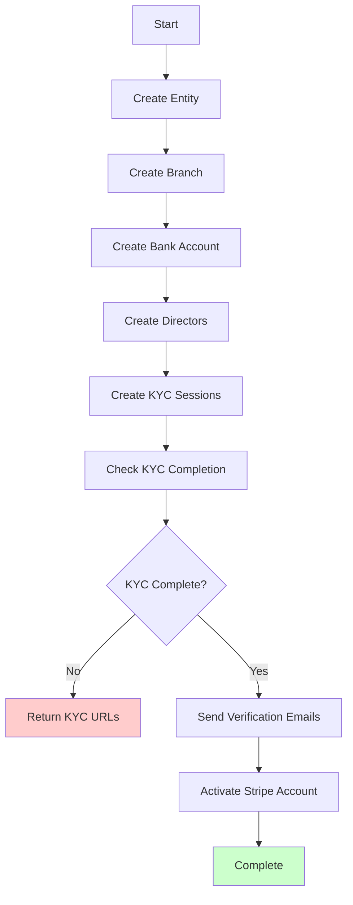

# Entity API

## Overview

The Entity API handles franchise entity creation and management. This includes setting up business entities, branches, bank accounts, directors, and KYC verification.

## Endpoints

### Get Entity Status

**GET** `/api/partner/entity/{entityId}`

Retrieves the current status of a specific entity.

#### Parameters

| Parameter | Type | Description |
|-----------|------|-------------|
| `entityId` | string | Unique identifier for the entity |

#### Response

```json
{
  "success": true,
  "id": "entity-123",
  "partnerId": "partner-456",
  "name": "Business Name",
  "abn": "12345678901",
  "status": "active",
  "address": {
    "line1": "123 Business St",
    "line2": "",
    "city": "Sydney",
    "state": "NSW",
    "postcode": "2000",
    "country": "Australia",
    "countryCode": "AU"
  },
  "accessedAt": "2024-01-15T10:30:00.000Z"
}
```

### Create Entity

**POST** `/api/partner/entity`

Creates a new franchise entity with all associated resources. This is a multi-step operation that handles entity creation, branch setup, bank account configuration, director management, KYC verification, and account activation.

#### Request Body

```json
{
  "business": {
    "abn": "12345678901",
    "entityType": "company",
    "entityStructure": "proprietary_limited",
    "mcc": "1520",
    "website": "https://example.com",
    "logoUrl": "https://example.com/logo.png"
  },
  "address": {
    "line1": "123 Business St",
    "line2": "",
    "city": "Sydney",
    "state": "NSW",
    "postcode": "2000",
    "country": "Australia",
    "countryCode": "AU"
  },
  "branch": {
    "name": "Sydney Branch",
    "contact": {
      "email": "jane@business.com",
      "phone": "+61412345678"
    }
  },
  "bankAccount": {
    "accountName": "Business Name",
    "accountNumber": "123456789",
    "bsb": "012-345"
  },
  "directors": [
    {
      "firstName": "John",
      "lastName": "Smith",
      "email": "john@business.com",
      "phone": "+61412345679",
      "percentOwnership": 50,
      "dateOfBirth": {
        "day": 1,
        "month": 1,
        "year": 1980
      },
      "address": {
        "line1": "789 Director St",
        "line2": "",
        "city": "Sydney",
        "state": "NSW",
        "postcode": "2000",
        "country": "Australia",
        "countryCode": "AU"
      },
      "relationship": "director"
    }
  ]
}
```

#### Request Field Requirements

| Field | Type | Required | Description |
|-------|------|----------|-------------|
| `business.abn` | string | ✅ | 11-digit Australian Business Number (used as idempotency key) |
| `business.entityType` | string | ✅ | Must be: `company`, `individual`, or `non_profit` |
| `business.entityStructure` | string | ❌ | Business structure (e.g., "proprietary_limited") |
| `business.mcc` | string | ❌ | 4-digit Merchant Category Code (e.g., "1520" for General Services) |
| `business.website` | string | ❌ | Business website URL |
| `business.logoUrl` | string | ❌ | Business logo URL |
| `address` | object | ✅ | Business address (separate from business object) |
| `branch.name` | string | ✅ | Branch/location name |
| `branch.contact.email` | string | ✅ | Branch contact email (will be verified) |
| `bankAccount.accountName` | string | ✅ | Bank account holder name |
| `bankAccount.accountNumber` | string | ✅ | Bank account number |
| `bankAccount.bsb` | string | ✅ | Bank-State-Branch code (format: XXX-XXX) |
| `directors` | array | ✅ | Array of business directors |
| `directors[].firstName` | string | ✅ | Director's first name |
| `directors[].lastName` | string | ✅ | Director's last name |
| `directors[].email` | string | ✅ | Director's email address |
| `directors[].phone` | string | ✅ | Director's phone number |
| `directors[].percentOwnership` | number | ✅ | Director's ownership percentage |
| `directors[].dateOfBirth` | object | ✅ | Director's date of birth |
| `directors[].address` | object | ✅ | Director's address |
| `directors[].relationship` | string | ✅ | Relationship to business: `director`, `owner`, `executive`, or `representative` |

#### Response Examples

**Successful Setup (All Steps Complete)**

```json
{
  "success": true,
  "entity": {
    "id": "entity-123",
    "name": "Entity Created",
    "abn": "12345678901",
    "status": "active"
  },
  "branch": {
    "id": "branch-456",
    "name": "Sydney Branch",
    "status": "active"
  },
  "bankAccount": {
    "id": "ba_1234567890",
    "status": "active"
  },
  "directors": [
    {
      "id": "director-789",
      "firstName": "John",
      "lastName": "Smith",
      "kycID": "kyc_123456",
      "kycStatus": "success",
      "percentOwnership": 50,
      "identityVerificationUrl": "https://<environment>-pebl.web.app/api/identity/verify/<session-id>"
    }
  ],
  "nextSteps": {
    "emailVerificationRequired": false,
    "emailVerificationUrl": "https://<environment>-pebl.web.app/api/email/verify?token=<token>",
    "kycRequired": false,
    "activationRequired": false,
    "totalOwnershipPercentage": 100,
    "verifiedOwnershipPercentage": 100
  },
  "debug": {
    "operationType": "created",
    "cachedResultUsed": false,
    "validationWarnings": [],
    "processingTimeMs": 2500
  }
}
```

**KYC Verification Required**

```json
{
  "success": false,
  "error": "Franchise setup failed",
  "retryable": true,
  "validationErrors": [
    {
      "field": "kyc_completion",
      "message": "KYC verification required before activation",
      "suggestion": "Please distribute KYC URLs to directors and retry after completion"
    }
  ],
  "debug": {
    "validationTimeMs": 150,
    "totalErrors": 1
  }
}
```

## Multi-Step Process

The Create Entity endpoint orchestrates a complex multi-step process:



### Step Details

1. **Create Entity**: Establishes the business entity
2. **Create Branch**: Creates a physical location for the franchise
3. **Create Bank Account**: Links bank account to payment processing
4. **Create Directors**: Adds business directors with ownership percentages
5. **Create KYC Sessions**: Initiates identity verification for directors
6. **Check KYC Completion**: Validates that required directors have completed verification
7. **Send Verification Emails**: Sends confirmation emails to all parties
8. **Activate Stripe Account**: Fully activates the payment processing account

## KYC Verification Flow

KYC (Know Your Customer) verification is required for directors with more than 25% ownership.

### KYC Process

1. **API Call**: Your initial API call creates KYC sessions
2. **URL Generation**: The API returns verification URLs for each director
3. **Director Verification**: Directors complete verification using the provided URLs
4. **Status Check**: Subsequent API calls check verification status
5. **Account Activation**: Once KYC is complete, the account is activated

### KYC URL Format

```
https://[environment]-pebl.web.app/api/identity/verify/[session-id]
```

### KYC Requirements

- **Ownership Threshold**: Directors with >25% ownership must complete KYC
- **Verification Method**: Identity verification through Stripe Identity
- **Documentation**: Government-issued ID and proof of address
- **Time Limit**: Verification URLs expire after 24 hours

## Idempotency

All entity operations are idempotent using the ABN as the key. This means:

- You can safely retry requests with the same ABN
- No duplicate entities will be created
- The API will return the current state of the entity
- Partial progress is preserved between retries

**Best Practices**:
1. **Retry on failures**: If you receive a `retryable: true` response, retry the same request
2. **Check status**: Use the GET endpoint to check operation status between retries
3. **Handle partial completion**: The API will resume from where it left off
